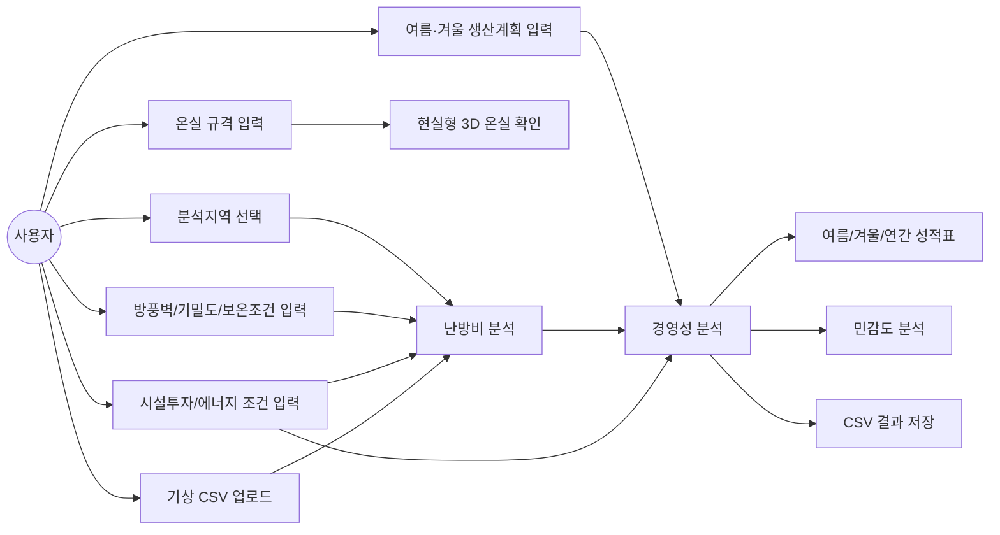
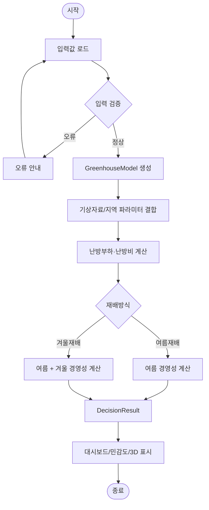
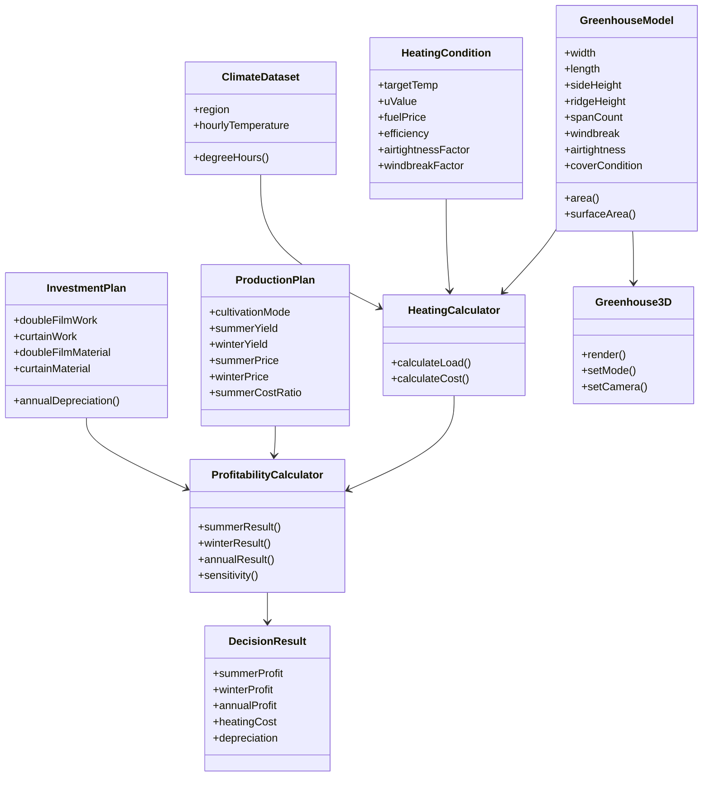
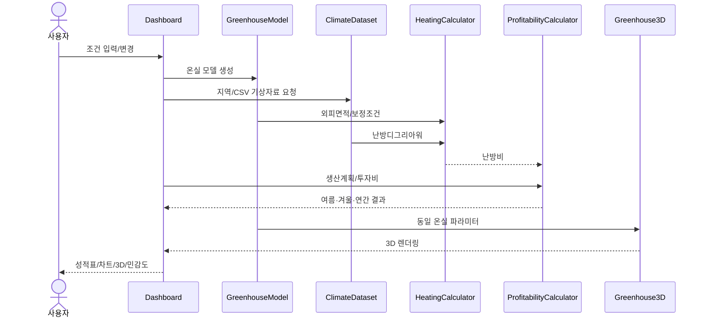

# UML — 무화과 가온재배 3D 경영의사결정지원시스템

> Mermaid 지원 GitHub 화면에서 다이어그램으로 렌더링된다.

## 1. Use Case

## 2. Activity

## 3. Class

## 4. Sequence

## 변경관리 규칙
코드의 데이터 객체, 계산 흐름, 사용자 입력 또는 출력이 변경되면 해당 UML을 같은 변경 단위에서 수정한다.
