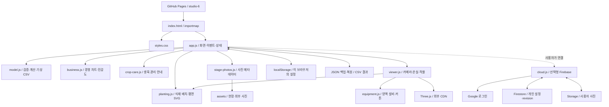

# 아키텍처 · 수정 안내

기준: 배포 v0.14 / 2026-10-05. 이 문서는 현재 구현을 설명합니다. 새로운 기능을 추가하면 이 문서와 UML.md를 함께 갱신하세요.

## 배포 구조

공개 앱: https://kuk-jong.github.io/fig-heating-cost-app/studio-6/

GitHub 저장소의 `main`에 있는 `studio-6/`를 GitHub Pages가 제공합니다. 별도 서버 빌드나 데이터베이스 없이 HTML·CSS·JavaScript ES 모듈이 브라우저에서 실행됩니다. 루트·`integrated-3d/`·`v2-3d/`는 기존 앱이며 수정 대상에서 제외합니다.

## 구성과 의존 관계

## 파일별 수정 위치

| 파일 | 역할 / 수정할 때 |
| --- | --- |
| index.html | 제목·헤더·내비게이션 자리·콘텐츠 관리 다이얼로그·Three.js importmap·버전 배지 |
| app.js | 6화면 HTML 조립, 입력 이벤트, 사진 교체, 설정 내보내기, 월별 생육 연결 |
| styles.css | 배치·글자·색·반응형 크기. 뒤쪽의 덮어쓰기 규칙이 우선될 수 있음 |
| model.js | DEFAULTS, validate, calculate, REGIONS, parseWeather. 수치 모델의 중심 |
| planting.js | 동일한 식재 중심 간격을 쓰는 plantingLayout과 평면 plantingPlan |
| business.js | 경영 시각화와 민감도 조작. 기준 상태를 복제한 시나리오 계산 |
| viewer.js | 온실·작물·외피·카메라와 WebGL 수명 관리 |
| equipment.js | 기본 규격의 양액기·탱크·배관·천장 커튼. 투자·난방 계산과 독립 |
| crop-care.js | 단계별 관리·점검·대응과 출처. 병해충 예측·약제 처방 기능은 아님 |
| stage-photos.js | 기본 생육 사진 경로·저작자·라이선스·원문 링크 |
| PHOTO-CREDITS.md | 기본 사진의 출처와 이용 조건 |
| cloud.js | Firebase 연결과 개인 작업공간의 명시적 저장·불러오기 |
| firestore.rules / storage.rules | 사용자 UID별 접근 제한. Firebase 프로젝트에 별도 적용 필요 |

## 화면별 연결

| 해시 | 화면 | 핵심 파일 |
| --- | --- | --- |
| #design | 온실설계 | app.js, model.js, planting.js, viewer.js, equipment.js |
| #energy | 기상·에너지 | app.js, model.js |
| #production | 재배·생산 | app.js, crop-care.js, stage-photos.js, model.js |
| #investment | 시설투자 | app.js, model.js |
| #business | 경영분석 | business.js, model.js |
| #simulation | 3D 시뮬레이션 | viewer.js, equipment.js, planting.js, model.js |

재배·생산에는 3D가 없습니다. 메인 3D의 설비·외피는 표시, 커튼은 열림으로 고정합니다. 별도 시뮬레이션에는 설비·외피 표시와 커튼 개폐 메뉴가 있습니다. 양액기 쪽(-Z)이 정면이며 사선 기본 시점도 같은 쪽입니다.

## 데이터와 동작

1. 시작 시 DEFAULTS를 복제하고 localStorage의 JSON이 있으면 validate로 검증합니다.
2. 입력 변경은 공통 state를 갱신하고 검증·저장한 다음 화면 전체를 다시 렌더링합니다.
3. calculate(state)는 면적·주수·겨울난방·생산매출·투자·감가상각·순이익·회수기간 등을 반환합니다.
4. 3D 재렌더링 시 이전 renderer·controls·geometry·material을 정리합니다. 비동기 로딩 중 화면이 바뀌면 generation으로 오래된 뷰를 폐기합니다.

state.version은 1, 표시 앱 버전은 v0.14입니다. 두 버전은 목적이 다릅니다. 저장 키는 `fig-studio-6-v1`, 직전 복원본은 `fig-studio-6-v1-backup`, Firebase 웹 설정은 `fig-studio-firebase`입니다. 카메라·보기 방식·설비 표시·커튼 개폐는 메모리 값이며 재접속 저장 대상이 아닙니다.

images는 design·facility·stage(기존 공통 사진)·stage0~stage5를 지원합니다. 개별 생육 사진 → 공통 생육 사진 → 기본 외부 사진 순으로 표시합니다. 사진 업로드는 파일당 1MB, JSON 불러오기는 15MB 이하입니다. 브라우저 저장 공간은 환경마다 다르므로 저장 실패 안내가 뜨면 파일 백업을 사용하세요.

기상은 11~2월 120일의 월일별 최저기온입니다. CSV 미입력일은 모의값으로 보완하며 관측 데이터 자동 수집 기능은 없습니다. 기본 지역별 모의자료는 REGIONS에서 편집합니다. 난방 외피 계산과 3D 지붕 형상은 서로 다른 근사입니다. 설비 공간의 작물 생략은 3D 표시만 바꾸며 주수·투자·난방 계산을 바꾸지 않습니다.

## 다른 컴퓨터에서 수정하기

### 코드·공식 기본 콘텐츠

1. 이 저장소 최신 main을 내려받거나 GitHub에서 해당 파일을 엽니다. 실제 앱 폴더는 studio-6입니다.
2. 별도 작업 브랜치에서 수정합니다. 로컬 작업을 할 때는 HTTP 정적 서버로 열고 file://로 실행하지 않습니다.
3. 해당 화면과 모바일 배치, JSON 저장·복원, 계산 변경 시 비교 시나리오를 확인합니다.
4. PR에서 변경 경로가 studio-6 내부인지 확인한 뒤 main에 병합합니다.
5. Pages 반영 후 공개 주소에서 버전과 수정 화면을 확인합니다. 캐시가 남으면 새로고침하거나 ?v=새버전을 붙입니다.

### 입력 조건·개인 사진

앱의 콘텐츠 관리로 바꾼 내용은 저장소 소스와 별개입니다. 기기 간 이동에는 설정·이미지 JSON을 내보내고 다른 기기에서 불러옵니다. Firebase를 실제 프로젝트에 연결하면 같은 Google 계정으로 명시적 저장·불러오기가 가능합니다. 코드가 제공되어 있어도 자동 동기화가 활성화되는 것은 아닙니다. 실계정 연결은 미검증입니다.

공식 기본 사진을 바꾸려면 assets와 stage-photos.js를 함께 수정하고 PHOTO-CREDITS.md를 갱신합니다. 병해충 안내는 crop-care.js에서 수정하며 출처·작형 적용 범위를 유지합니다.

## 확장 시 점검

- 새 저장 필드: DEFAULTS와 validate를 함께 변경하고 구버전 JSON 불러오기를 확인합니다.
- 새 지역: REGIONS와 입력 선택을 확인합니다. 실제 기상과 모의값 표기를 구분합니다.
- 설비 투자 연동: equipment.js의 그림만 바꾸지 말고 model.js의 계산 기준·시설 항목·단위도 설계합니다.
- Firebase 구조 변경: cloud.js, 보안 규칙, UML 데이터 모델과 문서를 함께 수정합니다.
- UI를 관리자로 수정해도 모든 사용자에게 게시되는 기능은 현재 없습니다.

UML은 [UML.md](UML.md), 프로젝트 사용법은 [README.md](README.md)를 참고하세요.
