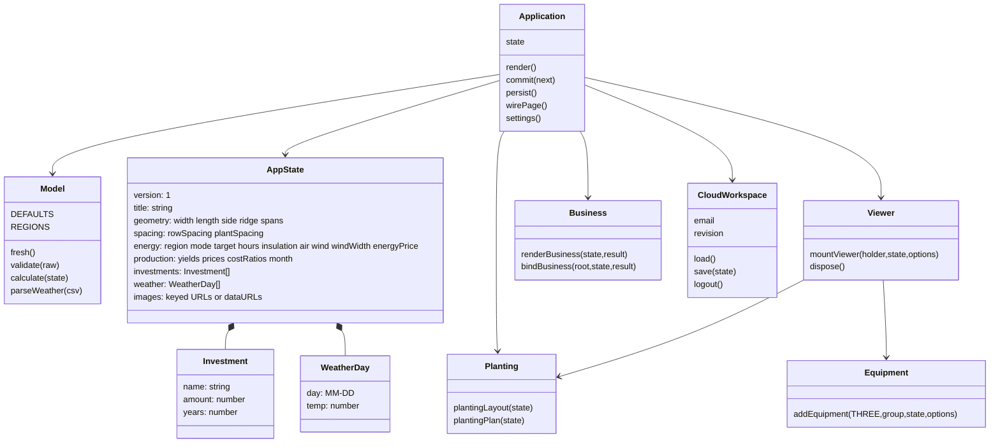
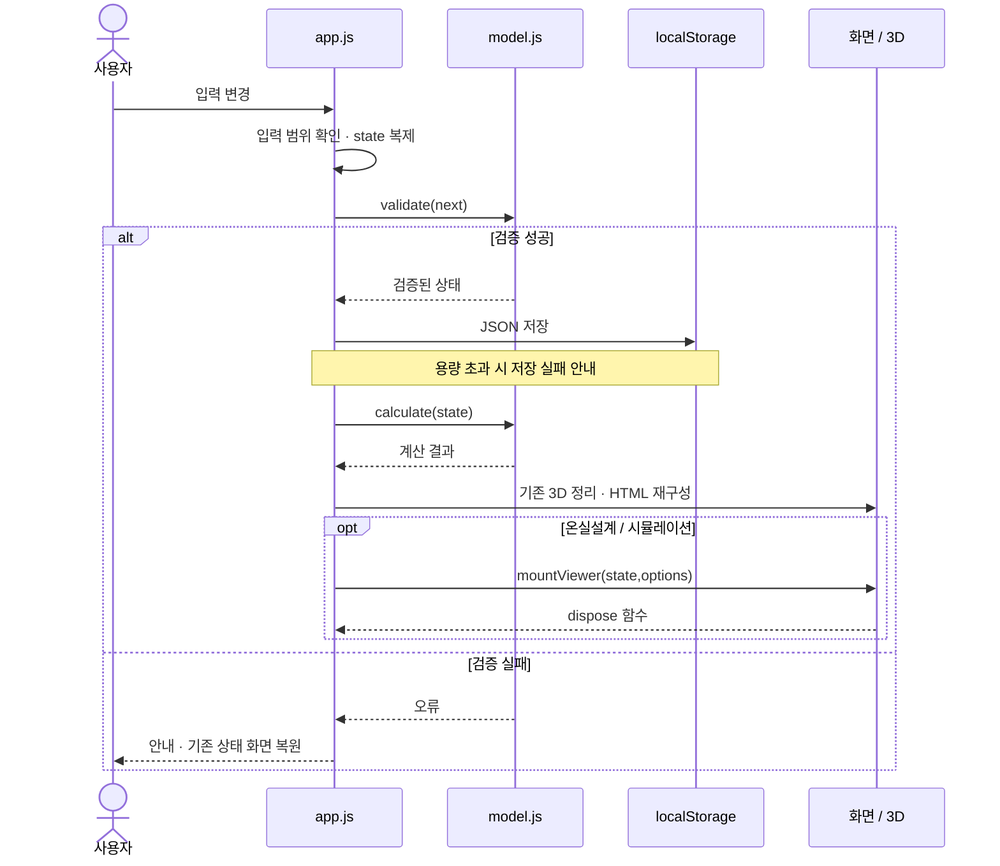
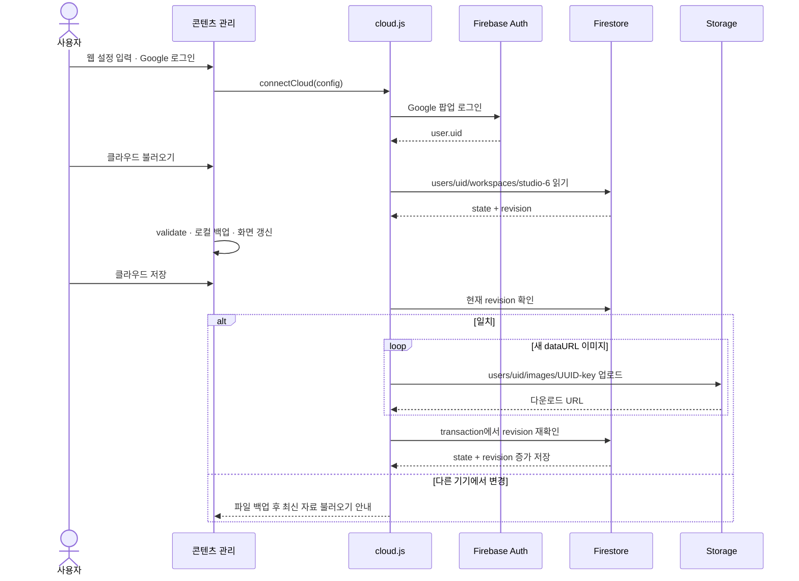

# UML · 현재 구현

기준: v0.14 / 2026-10-05. 함수 중심 JavaScript 앱이므로 아래 클래스 표기는 실제 class 선언이 아니라 모듈 책임과 데이터 구조를 나타냅니다.

## 모듈과 데이터 구조

AppState의 geometry·spacing·energy·production은 설명용 분류입니다. 실제 JSON은 계층화하지 않고 width·length·month 등을 바로 포함합니다. Investment.amount는 300평 기준 만원, WeatherDay.temp는 ℃입니다.

## 입력 변경 시퀀스

## 선택형 클라우드 저장 시퀀스

클라우드는 같은 UID의 개인 작업공간입니다. 공동 편집·자동 저장·공식 콘텐츠 게시 시스템이 아닙니다. 이미지 업로드 후 transaction이 실패하면 이미지가 남을 수 있어 정리가 별도로 필요합니다. Firebase 프로젝트와 규칙 적용은 실제 연결의 선행 조건입니다.
