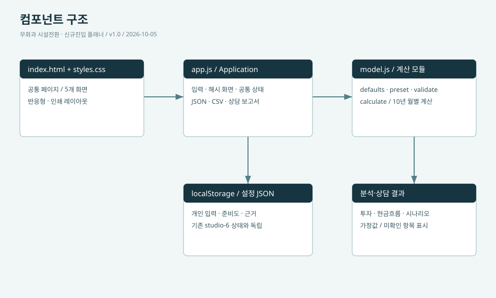
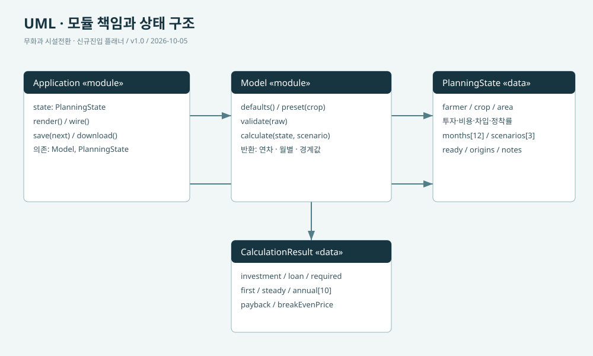

# 설계 문서 · v1.0

기존 시설 앱과 독립된 의사결정 플래너입니다. 가정·비교·현장 확인을 중심으로 설계합니다.

## 책임과 수정 위치

| 파일 | 책임 |
| --- | --- |
| index.html | 공통 헤더·내비게이션·설정 파일 도구·페이지 자리 |
| app.js | 5개 화면 렌더링, 공통 상태, 이벤트, 시나리오 시각화, 보고서·CSV·JSON |
| model.js | defaults, 작형 가정값 preset, validate, calculate의 10년 현금 모델 |
| styles.css | 색·배치·반응형·인쇄 스타일 |
| diagrams/ | 실제 SVG 설계도. 코드 책임 변경 시 함께 수정 |

## 데이터 계약

상태 version 1. `farmer`는 existing 또는 new, `crop`은 rain/extend/early/winter. months는 12개 kg·price·heat 행, investments는 name·amount·years·reuse 행, scenarios는 3개 yield·price·energy 배율입니다. ready는 준비 사실 6개 boolean, origins는 항목별 근거 표시, notes는 상담 메모입니다.

localStorage 키는 `fig-transition-plan-v1`, 불러오기 전 백업은 같은 키의 `-backup`입니다. 기존 studio-6 데이터는 읽거나 수정하지 않습니다. 설정 파일은 1MB 이하입니다.

## 입력과 렌더링

입력 change → state 복제 → validate → state 적용 → 로컬 저장 → calculate → 현재 해시 화면 다시 렌더링. 화면 전환은 계산 입력을 변경하지 않습니다. 저장 용량 초과 시 메모리 상태를 유지하고 백업 안내를 표시합니다.

작형 선택만으로 월별 자료를 덮어쓰지 않습니다. 가정값 적용 버튼은 교체를 확인한 뒤 preset을 적용하고 해당 월별 근거를 가정값으로 되돌립니다. 투자 삭제는 행별 근거 인덱스를 함께 이동합니다.

## 계산 흐름

1. 기존 농가는 reuse=false만 신규 투자, 신규 농가는 전체 신규 투자로 합산합니다.
2. 대출은 신규 투자×차입비율, 연간 원금은 대출/상환년수입니다.
3. 10년 각 연차에 첫 2년 정착률과 시나리오 배율을 적용합니다.
4. 매출·물량 변동비·직접 입력 난방비·균등 고정비·노동을 월별 합산합니다.
5. 영업현금, 감가상각·이자·자가노동 차감 잔여액, 원리금 차감 현금을 구분합니다.
6. 첫해 잔액은 -(투자-대출)부터 시작해 최대 부족액을 계산합니다.
7. 누적 추가 영업현금은 -신규 투자부터 시작해 기존 실적 대비 회수 연차를 찾습니다.

계산 범위와 미반영 항목은 README의 계산과 한계를 함께 읽으세요. 모델은 지역별 실증 생산 예측이나 자동 투자 권고를 하지 않습니다.

## 후속 확장

실증 자료 연결, 재배 가능성 검토, 월별 고용노동 일정, 보조금·거치기간, 비상각 자산, 자산별 상각 종료와 교체투자, 기상 기반 난방 모델, 금융 할인 현금흐름은 별도 모델 확장 대상입니다. 확장할 때 validate와 구버전 JSON 처리·독립 계산 검증·이 문서를 함께 갱신합니다.
